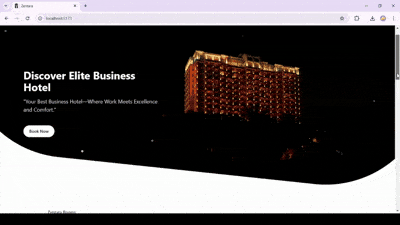

# Hotel Reservation System  

This project is a **simple hotel reservation form** that allows users to book rooms by selecting room types and specifying the number of nights. It is built with modern web technologies to ensure a seamless and secure booking experience.  

---

## Features  
- User-friendly **reservation form** with dynamic room selection.  
- **Real-time validation** for inputs such as room type and number of nights.  
- **Responsive design** styled with **Tailwind CSS**.  
- Data storage and management using **MySQL** via **MySQL Workbench**.  

---

## Tech Stack  
### Backend  
- **Spring Boot** with **Maven**: For building RESTful APIs and handling backend logic.  

### Frontend  
- **React** with **Vite**: For creating a fast and interactive user interface.  
- **Tailwind CSS**: For modern, responsive styling.  

### Database  
- **MySQL**: For secure data storage and management of user credentials and booking details.  

---

## Installation  

### Prerequisites  
- **Java 17+** installed.  
- **Node.js** (v16 or above).  
- **MySQL Server** and **MySQL Workbench**.  

### Backend Setup  
1. Clone the repository:  
   ```bash  
   git clone https://github.com/MedYessinKhlif/HotelBooking 
   cd demo  
   ```  
2. Update the **application.properties** file in `src/main/resources` with your MySQL credentials:  
   ```properties  
   spring.datasource.url=jdbc:mysql://localhost:3306/hotel
   spring.datasource.username=username  
   spring.datasource.password=password  
   ```  
3. Build and run the backend:  
   ```bash  
   mvn spring-boot:run  
   ```  

### Frontend Setup  
1. Navigate to the frontend directory:  
   ```bash  
   cd client  
   ```  
2. Install dependencies:  
   ```bash  
   npm install  
   ```  
3. Start the development server:  
   ```bash  
   npm run dev  
   ```  
---

## Usage  
1. Start the backend and frontend servers.  
2. Open the application in your browser at `http://localhost:5173`.  
3. Register or log in to access the reservation form.  
4. Fill out the form with the required details and submit your booking.  

---

## Contribution  
Contributions are welcome! Feel free to open issues or submit pull requests.  

---

## Author  
**Med Yassine Khlif**  
Feel free to contact me at: khlifyassin5@gmail.com 

## Demo  
Here’s a quick preview of how the web application looks:  

